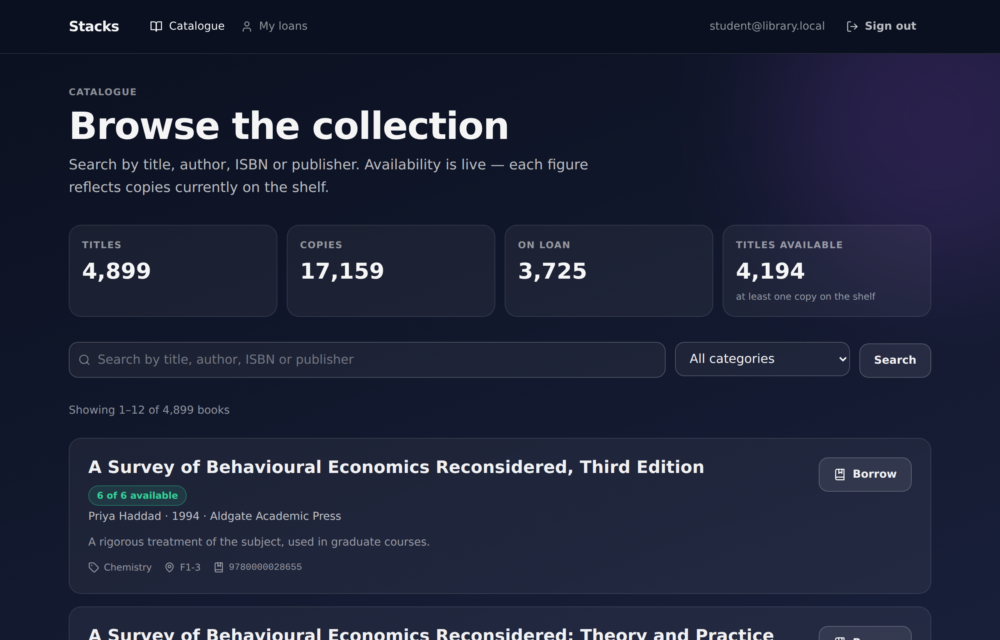
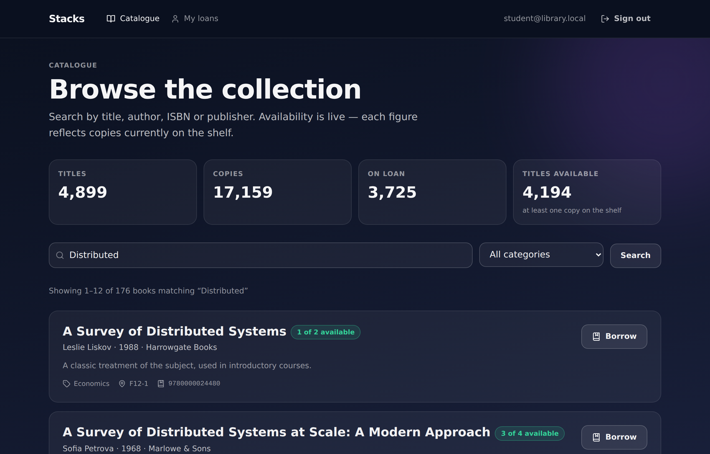
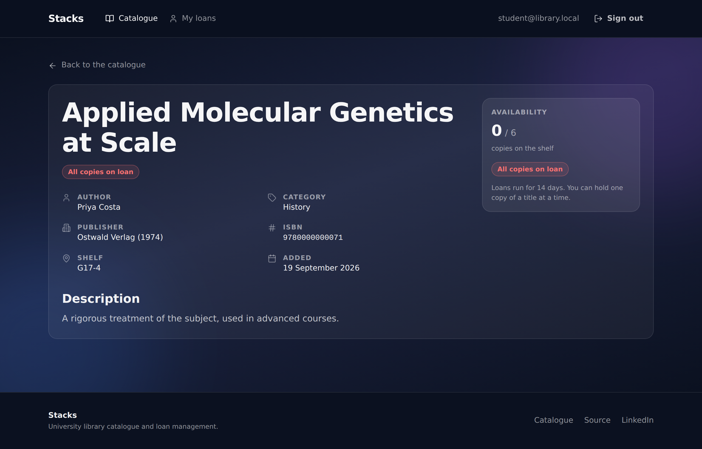
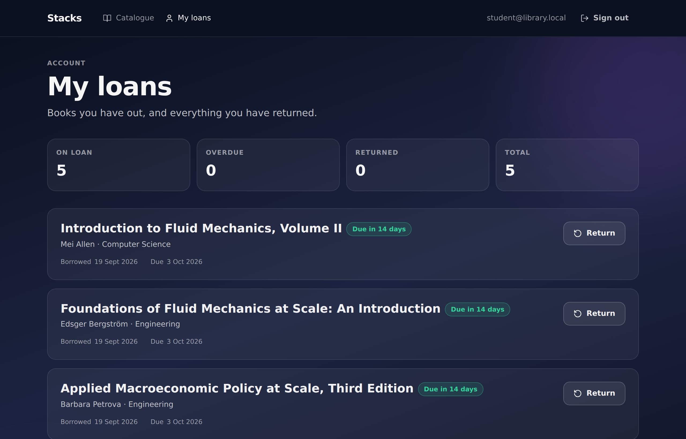

# Stacks — university library catalogue and loan management

A library lends physical copies. The interesting part is not the CRUD around
titles and authors; it is that a copy is a finite resource that two people can
reach for at the same instant. This project is a working catalogue and loan
system built around that problem: the copy count is the state that has to stay
correct, and the code is arranged so that it does.

Stack: Next.js 15 (App Router), TypeScript, PostgreSQL 16, Drizzle ORM,
NextAuth.

---

## Invariants

These four statements are true of the database at every instant, including
while concurrent requests are in flight. Each is enforced by a constraint, not
by a check in a request handler.

| Invariant | Enforced by |
|---|---|
| `0 <= available_copies <= total_copies` for every book | `CHECK` constraints `books_available_copies_non_negative`, `books_available_lte_total` |
| A borrower holds at most one active loan of a given title | Partial unique index `borrowings_one_active_loan_per_user_book` on `(user_id, book_id) WHERE status = 'borrowed'` |
| A loan is `returned` if and only if it has a `returned_at` timestamp | `CHECK` constraint `borrowings_returned_at_matches_status` |
| `sum(total_copies - available_copies)` equals the number of active loans | Maintained by the borrow/return transactions; the two `CHECK` constraints above make a drift impossible to persist |

The point of pushing these into the schema is that they survive code that has
not been written yet. A future admin screen, a batch import or a bug in a new
route cannot violate them; the write is rejected.

---

## Architecture

```
src/
  app/
    api/            route handlers — auth, borrow, return, books, signup, ...
    books/          catalogue, book detail, add-book
    my-books/       a borrower's loans
    admin/          staff-only figures
  components/       presentational + interactive UI
  db/
    schema.ts       Drizzle schema: tables, constraints, indexes
    index.ts        pooled connection
  lib/
    loans.ts        borrow / return — the concurrency-critical path
    books.ts        the browse query, shared by the page and the benchmark
    auth.ts         NextAuth options, session helpers, role checks
    validation.ts   typed parsers for every API input
    api.ts          response envelopes and status codes
drizzle/            SQL migrations (checked in, applied with drizzle-kit)
tests/              node:test suites, run against a real Postgres
scripts/            seeding and the query benchmark
```

Two deliberate choices:

- **The loan logic lives in `src/lib/loans.ts`, not in the route handler.** The
  route parses input, checks auth and maps a result to a status code. The
  transaction is a plain function, which is what the concurrency tests call —
  so the tests exercise the same code path the HTTP request does, without an
  HTTP server in the loop.
- **The browse query lives in `src/lib/books.ts`.** The page and the benchmark
  both build it from `browseFilter()`, so the numbers in the performance
  section below are measured against the query the application actually runs.

### Data model

Six tables. `users`, `categories`, `books`, `borrowings` are in active use;
`reservations` and `fines` exist in the schema and are not yet wired to any
feature.

```
categories 1 ──< books 1 ──< borrowings >── 1 users
                                  │
                                  └──< fines
```

- `books.category_id → categories.id` (nullable: a book may be uncategorised)
- `borrowings.book_id → books.id`, `borrowings.user_id → users.id` (both `NOT NULL`)
- `books.available_copies` is a denormalised counter. It could be derived by
  counting active loans, but that turns every catalogue page into an aggregate
  over the loans table. Keeping it as a column and guarding it with `CHECK`
  constraints trades one row update for a fast read.

---

## Concurrency

### Borrowing

Twenty people click *Borrow* on the last copy at the same moment. The naive
implementation — read `available_copies`, check it is positive, write back
`available_copies - 1` — has a window between the read and the write in which
every one of those requests sees the same value. All twenty succeed, and the
count goes to `-19`.

The implementation here never reads the value into the application at all:

```sql
UPDATE books
   SET available_copies = available_copies - 1
 WHERE id = $1 AND is_active = true AND available_copies > 0
RETURNING available_copies;
```

Postgres takes a row lock for the duration of that statement. Concurrent
updaters queue on it, and each one re-evaluates `available_copies > 0` against
the value the previous transaction committed. When the last copy is gone the
predicate is false, the statement affects zero rows, and zero rows is what
"unavailable" means — there is no separate check to race against.

The `INSERT` into `borrowings` runs in the same transaction. If it trips the
partial unique index (the same borrower already has this title out), the
transaction rolls back and takes the decrement with it, so a rejected duplicate
never leaks a copy.

**Alternative considered and rejected:** `SELECT ... FOR UPDATE` on the book
row, then branch in TypeScript, then `UPDATE`. It is correct, and it was
rejected for two reasons. It is three round trips where one will do, holding
the row lock across all of them and so widening the window in which other
borrowers are blocked. And it puts the rule in application code, where the next
person to add a write path has to remember to take the lock — whereas the
conditional `UPDATE` carries its own guard, and the `CHECK` constraint catches
anyone who forgets.

### Returning

The mirror image, and idempotent for the same reason:

```sql
UPDATE borrowings
   SET status = 'returned', returned_at = now()
 WHERE id = $1 AND user_id = $2 AND status = 'borrowed'
RETURNING book_id;
```

The first call matches, flips the row, and increments the book. Every later
call — a double-clicked button, a retried request, a replayed POST — matches
zero rows, so the increment never runs a second time and the copy count cannot
be inflated above `total_copies`.

---

## Tests

```
npm test
```

Run against a real Postgres database, not a mock: the invariants under test are
database invariants, and a fake would only prove the fake works.

22 tests, all passing. The ones that matter:

| Test | Concurrency | Asserts |
|---|---|---|
| 20 users race for 1 copy | 20 | exactly 1 succeeds, 19 get `unavailable`, `available_copies` ends at 0 and is never observed negative by a sampler reading on a separate connection during the burst |
| 20 users race for 5 copies | 20 | exactly 5 succeed, count ends at 0, every sample within `[0, 5]` |
| Same user fires 20 concurrent borrows | 20 | exactly 1 loan created, exactly 1 copy consumed |
| Same user borrows twice in sequence | 1 | second attempt rejected `already_borrowed`, copy count unchanged |
| Raw `INSERT` of a duplicate active loan | 1 | rejected by the database with SQLSTATE 23505 — proves the constraint is in the schema, not in the handler |
| 20 concurrent returns of one loan | 20 | exactly 1 succeeds, exactly 1 copy restored |
| Double return in sequence | 1 | second call reports `already_returned`, count stays at `total_copies` |
| Returning another user's loan | 1 | reports `not_found`, the loan stays open |
| Raw `UPDATE` to a negative count | 1 | rejected, SQLSTATE 23514 |

Plus 11 validation tests covering integer coercion, LIKE-wildcard escaping,
bcrypt's 72-byte truncation, and the fact that `availableCopies` is not a field
a client can set.

---

## Query performance

The catalogue page used to select every row in `books` and filter the array in
JavaScript. Filtering, sorting and paging now happen in Postgres. With that in
place, the remaining question is whether the query uses an index.

Measured by `npm run db:benchmark` against 5,000 seeded books on PostgreSQL
16.13. The benchmark renders the SQL once from the application's own query
builder and executes that exact text in both phases; the indexes are the only
thing that changes. 25 timed runs per phase after 5 discarded warm-ups, median
reported.

**Query A — category filter, sorted by title, first page of 12** (407 of 5,000 rows match)

| | Median | Plan |
|---|---|---|
| No index | 1.35 ms | `Seq Scan on books` → `Sort` |
| With `books_active_category_title_idx` | 0.47 ms | `Index Scan using books_active_category_title_idx` → `Incremental Sort` |

2.9× faster. The composite index leads with the filter columns and ends with
the sort column, so Postgres walks it in title order and stops after 13 rows
instead of sorting all 407.

**Query B — substring search, sorted by title, first page of 12** (176 of 5,000 rows match)

| | Median | Plan |
|---|---|---|
| No index | 11.86 ms | `Seq Scan on books` → `Sort` |
| With `books_active_title_idx` | 2.01 ms | `Index Scan using books_active_title_idx` → `Incremental Sort` |

5.9× faster, for the same reason: the `LIMIT` lets the ordered index scan exit
early rather than evaluating `ILIKE` against all 5,000 rows.

**Query C — the `COUNT(*)` that sizes the pager.** Worth reporting because it
is the case where an index did not help.

| | Category filter | Substring search |
|---|---|---|
| No index | 0.82 ms (`Seq Scan`) | 11.50 ms (`Seq Scan`) |
| With indexes | 0.24 ms (`Bitmap Heap Scan`) | 11.53 ms (`Seq Scan`) |

The category count improves 3.4×. The search count does not change at all: with
no `LIMIT` there is nothing to exit early from, so every row has to be tested
against the `ILIKE` predicate either way.

**On trigram indexes.** A `pg_trgm` GIN index is the usual answer to
`ILIKE '%term%'`, and it was built, measured and removed. Two findings. First,
an index declared on a `varchar` column is never used for `ILIKE`, because the
predicate is `(title)::text ~~* '...'` and the cast means the index expression
does not match; it has to be declared on `(title::text)`. Second, even with the
expression fixed, the planner would not choose it for these queries at this
table size — 5,000 rows is 150 heap pages, and the ordered index scan with an
early exit beats building a bitmap over the whole table. Four GIN indexes that
the planner never picks are pure write overhead, so they are not in the schema.
Worth revisiting if the catalogue grows by an order of magnitude.

---

## Hardening

- **Input validation.** Every route body and query string goes through a typed
  parser in `src/lib/validation.ts` before it reaches the database. Nothing is
  trusted from `await request.json()`.
- **Consistent responses.** Success is `{ data: ... }`; failure is
  `{ error: { code, message, details? } }` with a status that matches — 400 for
  malformed input, 401 unauthenticated, 403 wrong role, 404 missing, 409 for a
  well-formed request the current state forbids (`unavailable`,
  `already_borrowed`, `already_returned`, `email_taken`).
- **No leaked exceptions.** Thrown values are logged server-side and answered
  with a generic 500. Driver errors carry SQL text, constraint names and
  sometimes parameter values, and none of that reaches the client.
- **Server-side authorisation.** Every mutating route re-checks the session and
  the role. `POST /api/books` requires `librarian` or `admin`; the `/admin` and
  `/books/new` pages check the same thing before rendering. The navbar hiding a
  link is a convenience, never the control.
- **Ownership scoping.** `GET /api/receipt` previously returned any loan by id,
  including the borrower's name and email. It is scoped to the caller's own
  loans. Returning someone else's loan reports `not_found` rather than
  `forbidden`, so the response does not confirm that the loan exists.
- **Signup cannot grant privilege.** The role is fixed to `student`
  server-side; a `role` field in the request body is ignored.
- **Credentials.** bcrypt at 12 rounds. An unknown email is compared against a
  dummy hash so that a wrong address and a wrong password take the same time.
  Sign-in failures do not say which of the two was wrong.
- **Open redirect.** `?callbackUrl=` is honoured only for same-site paths.
- **LIKE injection.** `%`, `_` and `\` in a search term are escaped, so a user
  typing `100%` searches for `100%`.
- **Build-time type checking.** `next.config.ts` set
  `typescript.ignoreBuildErrors: true`, which was hiding 35 type errors. The
  flag is gone and the project typechecks clean.

No secrets are committed. `.env` is gitignored and has never appeared in the
history; `.env.example` documents the three variables that are needed.

---

## Setup

Requires Node 22+ and PostgreSQL 16+.

```bash
git clone https://github.com/JihanChowdhury334/nextjs-libary-platform.git
cd nextjs-libary-platform
npm install

cp .env.example .env
# set DATABASE_URL, and NEXTAUTH_SECRET=$(openssl rand -base64 32)

npm run db:migrate    # apply drizzle/*.sql
npm run db:seed       # 5,000 books, 12 categories, 62 users, ~3,800 active loans
npm run dev
```

Seeded accounts (local sample data only): `admin@library.local` and
`student@library.local`, both with the password `password123`.

| Script | What it does |
|---|---|
| `npm run dev` / `build` / `start` | Next.js |
| `npm run typecheck` | `tsc --noEmit` |
| `npm run lint` | ESLint |
| `npm test` | node:test suites — needs a migrated database |
| `npm run db:generate` | generate a migration from `src/db/schema.ts` |
| `npm run db:migrate` | apply migrations |
| `npm run db:seed` | reset and seed (`BOOK_COUNT` to change the size) |
| `npm run db:benchmark` | the before/after index measurement above |

Point `DATABASE_URL` at a throwaway database before running `npm test` or
`npm run db:seed`: both truncate every table.

The test runner is Node's built-in `node:test` with native TypeScript stripping
— no test framework dependency. `tests/alias-hooks.mjs` is a small resolver
hook that teaches Node the `@/` path alias and extensionless imports, so tests
import the same source files the application does.

---

## Screenshots

| | |
|---|---|
|  |  |
|  |  |

---

## Not built

Stated plainly, because an empty admin screen is worse than an honest one:

- **Reservations and fines** have tables and no features. Nothing reads or
  writes them.
- **Editing and withdrawing books** — the schema supports `is_active = false`,
  there is no UI for it. Books can be added, not changed or removed.
- **User management** — roles are assigned by a direct database update. There
  is no screen for promoting an account to librarian.
- **Overdue handling** is display-only. Overdue status is derived from
  `due_date` when the page renders; no fine is ever created and nothing is
  emailed.
- **Rate limiting** — signup and sign-in are not throttled.
- **Renewals, holds, loan history for staff, CSV import** — none of these exist.

---

## License

MIT. See [LICENSE](LICENSE).

Built by [Jihan Chowdhury](https://github.com/JihanChowdhury334) —
[nextjs-libary-platform](https://github.com/JihanChowdhury334/nextjs-libary-platform).
